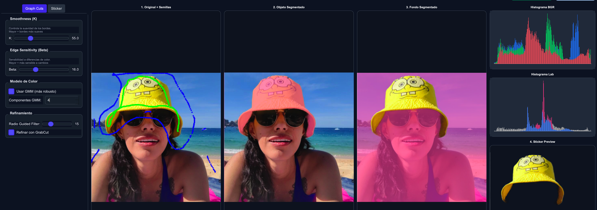
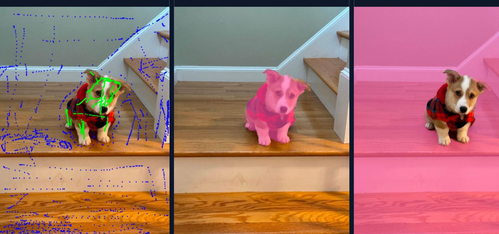
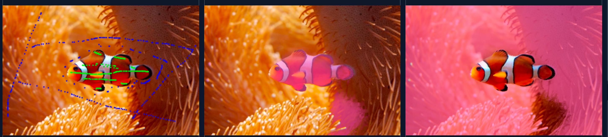
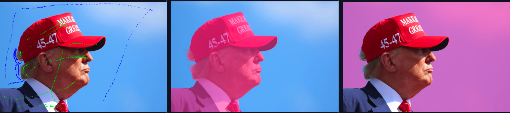

# 🎨 Graph Cuts Interactive Segmentation - Team 13 MNA Vision

[](https://www.python.org/downloads/)
[](https://opencv.org/)
[](https://opensource.org/licenses/MIT)

> **Segmentación interactiva de imágenes con Graph Cuts y parámetros ajustables en tiempo real**

Implementación mejorada del algoritmo Graph Cuts (Boykov & Jolly, 2001) con interfaz gráfica moderna en PyQt5, que permite ajustar parámetros de segmentación en tiempo real y generar stickers con transparencia.

<p align="center">
  
</p>

---

## 📋 Tabla de Contenidos

- [Características](#-características)
- [Instalación](#-instalación)
- [Uso Rápido](#-uso-rápido)
- [Parámetros](#-parámetros)
- [Estructura del Proyecto](#-estructura-del-proyecto)
- [Casos de Estudio](#-casos-de-estudio)
- [Troubleshooting](#-troubleshooting)
- [Autores](#-autores)
- [Referencias](#-referencias)

---

## ✨ Características

### 🔧 Core Algorithm
- ✅ **Graph Cuts** con garantías de optimalidad global (MaxFlow/MinCut)
- ✅ **Espacio de color Lab** para mejor discriminación perceptual
- ✅ **Modelo de color configurable**: Gaussiana simple o GMM (2-5 componentes)
- ✅ **Detección de bordes Canny** para términos de suavidad adaptativos
- ✅ **Post-procesamiento opcional**: GrabCut iterativo + Guided Filter

### 🎨 Interfaz de Usuario
- ✅ **Interfaz moderna PyQt5** con diseño responsivo
- ✅ **4 vistas simultáneas**: Semillas, Objeto, Fondo, Histogramas
- ✅ **Marcado interactivo** de semillas con mouse (verde=objeto, azul=fondo)
- ✅ **Control de parámetros en tiempo real** mediante sliders
- ✅ **Generación de stickers** PNG con transparencia, bordes y texto

### 📊 Parámetros Ajustables
| Parámetro | Rango | Efecto |
|-----------|-------|--------|
| **K (Smoothness)** | 1-200 | Suavidad de bordes |
| **Beta (Edge Sensitivity)** | 1-50 | Sensibilidad a cambios de color |
| **GMM Components** | 2-5 | Complejidad del modelo de color |
| **Guided Filter Radius** | 5-50 / Auto | Radio de refinamiento de bordes |
| **GrabCut Refinement** | On/Off | Post-procesamiento iterativo |

---

## 🚀 Instalación

### Requisitos Previos
- Python 3.8 o superior
- pip (gestor de paquetes de Python)

### Paso 1: Clonar el Repositorio
```bash
git clone https://github.com/Team13-TecMonterrey/GraphCuts-Interactive.git
cd GraphCuts-Interactive
```

### Paso 2: Crear Entorno Virtual (Recomendado)
```bash
python3 -m venv venv
source venv/bin/activate  # En Windows: venv\Scripts\activate
```

### Paso 3: Instalar Dependencias
```bash
pip install -r requirements.txt
```

**Nota para macOS/Linux:**
```bash
pip install -r requirements.txt --break-system-packages
```

### Paso 4: Verificar Instalación
```bash
python -c "import cv2, PyQt5, maxflow; print('✓ Instalación exitosa')"
```

---

## 🎯 Uso Rápido

### Modo Básico
```bash
python GraphCutsProjectTeam13.py
```

### Flujo de Trabajo

1. **Cargar Imagen** 
   - Click en "Cargar imagen" (botón superior izquierdo)
   - Formatos soportados: PNG, JPG, JPEG, BMP, TIFF

2. **Marcar Semillas**
   - **Verde (Objeto)**: Click izquierdo con botón "Semilla OBJETO" activo
   - **Azul (Fondo)**: Click izquierdo con botón "Semilla FONDO" activo
   - Arrastra el mouse para marcar regiones grandes

3. **Ajustar Parámetros** (Tab "Graph Cuts")
   - K: Mayor = bordes más suaves
   - Beta: Mayor = más sensible a cambios de color
   - GMM: Activar para objetos multicolor
   - GrabCut: Activar para máxima calidad (más lento)

4. **Segmentar**
   - Click en "Segmentar" (botón verde)
   - Espera 5-15 segundos (según configuración)

5. **Exportar Resultados**
   - **Objeto segmentado**: Click "Guardar Objeto" → YES
   - **Solo objeto sin overlay**: Click "Guardar Objeto" → NO
   - **Sticker personalizado**: Ajusta en Tab "Sticker", luego guarda

---

## 📐 Parámetros

### Guía de Configuración por Tipo de Imagen

#### 🟢 Fondo Uniforme (Cielo, Pared Lisa)
```
K = 40-50
Beta = 15-20
GMM = No
GrabCut = Opcional
```
**Ejemplo:** Retrato con cielo azul

---

#### 🟡 Fondo Texturado (Naturaleza, Madera)
```
K = 70-90
Beta = 8-12
GMM = Sí (3-4 componentes)
GrabCut = Sí
```
**Ejemplo:** Animal en bosque, objeto sobre madera

---

#### 🟠 Colores Similares Objeto/Fondo
```
K = 40-60
Beta = 6-10 (BAJO)
GMM = Sí (4-5 componentes)
GrabCut = Sí
Radio GF = 20-30
```
**Ejemplo:** Pez naranja en anémona naranja, perro café en piso café

---

#### 🔴 Fondo Desenfocado (Bokeh)
```
K = 80-100
Beta = 6-8
GMM = Sí (4 componentes)
GrabCut = Sí
Radio GF = 25-35
```
**Ejemplo:** Retrato con fondo difuminado

---

#### ⚫ Escala de Grises (Imágenes Médicas)
```
K = 70-80
Beta = 5-10
GMM = Opcional
GrabCut = Sí
```
**Ejemplo:** Mamografía, Rayos X

---

## 📁 Estructura del Proyecto
```
GraphCuts-Interactive/
│
├── GraphMakerTeam13.py          # Motor de segmentación (backend)
├── GraphCutsProjectTeam13.py    # Interfaz gráfica (frontend)
├── requirements.txt              # Dependencias
├── README.md                     # Este archivo
│
├── docs/
│   ├── demo_screenshot.png
│   ├── architecture_diagram.png
│   └── manual_usuario.pdf
│
├── examples/
│   ├── images/                   # Imágenes de prueba
│   │   ├── simba_corgi.jpg
│   │   ├── pez_payaso.jpg
│   │   ├── trump_profile.jpg
│   │   └── ...
│   │
│   └── results/                  # Resultados de ejemplo
│       ├── SimbaResultado.png
│       ├── PezResultado.png
│       └── ...
│
└── tests/
    └── test_graphmaker.py        # Tests unitarios
```

---

## 🧪 Casos de Estudio

### Caso 1: Perro Corgi (Simba) - 🔴 Difícil
**Reto:** Pelaje café sobre piso de madera café

**Solución:**
```
K = 42.0
Beta = 9.0 (BAJO para tolerar similitud)
GMM = Sí (4 componentes)
GrabCut = Sí
Radio GF = 15
```

**Estrategia de semillas:**
- ✅ Verde: Centro del perro, evitar bordes con piso
- ✅ Azul: **MUCHAS semillas en el piso** (8-10 puntos)
- ✅ Azul: En sombras del perro sobre piso



---

### Caso 2: Pez Payaso - 🔴🔴 Extremo
**Reto:** Pez naranja EN anémona naranja (colores idénticos)

**Solución:**
```
K = 89.0 (MUY ALTO)
Beta = 9.0 (BAJO)
GMM = Sí (5 componentes)
GrabCut = Sí
```

**Estrategia de semillas:**
- ✅ Verde: Solo centro del pez (naranja + franjas blancas/negras)
- ✅ Azul: 5-8 puntos en tentáculos naranjas
- ✅ Azul: Áreas café oscuro de la anémona



---

### Caso 3: Trump Perfil - 🟢 Fácil
**Reto:** Ninguno, alto contraste rojo/azul

**Solución:**
```
K = 50.0
Beta = 16.0
GMM = No
GrabCut = Sí
```

**Resultado:** Segmentación perfecta al primer intento



---

## ❓ Troubleshooting

### Error: `ModuleNotFoundError: No module named 'sklearn'`
```bash
pip install scikit-learn --break-system-packages
```

### Error: `module 'maxflow' has no attribute 'Graph'`
```bash
pip uninstall maxflow
pip install pymaxflow
```

### Error: `cv2.ximgproc not found`
```bash
pip uninstall opencv-python
pip install opencv-contrib-python
```

### Warning: "Usando desenfoque Gaussiano como alternativa"
- No es error crítico
- Significa que `opencv-contrib-python` no está instalado
- Guided Filter se reemplaza por Gaussian Blur (menor calidad pero funcional)

### Segmentación captura solo las semillas
**Problema:** Parámetros incorrectos o semillas insuficientes

**Solución:**
1. Baja Beta (5-10) si colores similares
2. Marca MÁS semillas azules en el fondo (mínimo 5-8 puntos)
3. Activa GMM si objeto tiene múltiples colores

### Programa no abre / crash al iniciar
```bash
# Verificar versión de Python
python --version  # Debe ser 3.8+

# Reinstalar PyQt5
pip uninstall PyQt5
pip install PyQt5
```

---

## 👥 Autores

**Team 13 - Visión Computacional para Imágenes y Video**

| Nombre | Rol | Email |
|--------|-----|-------|
| **Javier Augusto Rebull Saucedo** | Arquitecto de Software & Integración | A01795838@tec.mx |
| **Juan Carlos Pérez Nava** | Investigador Algorítmico & Optimización | A01795941@tec.mx |
| **Luis Gerardo Sánchez Salazar** | Especialista en UX/UI & Visualización | A01232963@tec.mx |
| **Oscar Enrique García García** | Ingeniero de Calidad & Experimentación | A01016093@tec.mx |

**Institución:** Tecnológico de Monterrey  
**Programa:** Maestría en Inteligencia Artificial Aplicada  
**Fecha:** Diciembre 2025

---

## 📚 Referencias

1. **Boykov, Y., & Jolly, M. P. (2001).** "Interactive Graph Cuts for Optimal Boundary & Region Segmentation of Objects in N-D Images." *ICCV 2001*.

2. **Rother, C., Kolmogorov, V., & Blake, A. (2004).** "GrabCut: Interactive Foreground Extraction using Iterated Graph Cuts." *ACM SIGGRAPH 2004*.

3. **He, K., Sun, J., & Tang, X. (2013).** "Guided Image Filtering." *IEEE Transactions on Pattern Analysis and Machine Intelligence*.

4. **Boykov, Y., & Kolmogorov, V. (2004).** "An Experimental Comparison of Min-Cut/Max-Flow Algorithms for Energy Minimization in Vision." *IEEE TPAMI*.

---

## 📄 Licencia

Este proyecto fue desarrollado con fines académicos como parte del curso de Visión Computacional en el Tecnológico de Monterrey.

**Profesores:**
- Dr. Gilberto Ochoa Ruiz
- MIP Ma. del Refugio Melendez Alfaro
- M. en C. Jose Angel Martinez Navarro

---

## 🙏 Agradecimientos

- OpenCV Community por documentación exhaustiva
- PyQt5 Team por framework UI robusto
- Boykov & Jolly por el algoritmo seminal de Graph Cuts

---

---

**⭐ Si este proyecto te fue útil, considera darle una estrella en GitHub!**